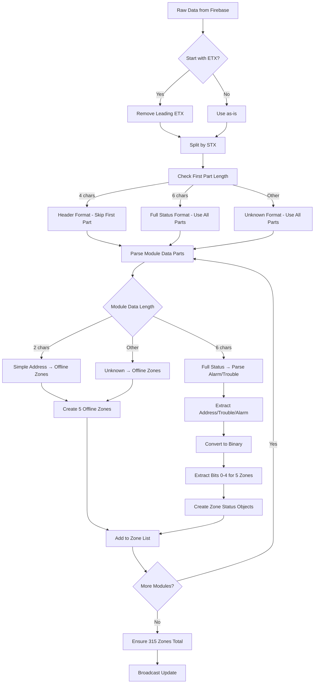

# 🔧 PARSING DATA ZONA ESP32 - PERBAIKAN LENGKAP

## 📋 **MASALAH YANG DITEMUKAN**

### ❌ **Kesalahan Parsing Sebelumnya:**
1. **Format Data Salah** - Menganggap semua data sebagai hexadecimal 16-bit
2. **Struktur Data Tidak Sesuai** - Tidak membedakan format data dengan/tanpa jawaban slave
3. **Bit Extraction Error** - Logic pencabutan bit alarm/trouble tidak sesuai spek
4. **Module Numbering Salah** - Tidak konsisten dengan format data aktual

---

## 🚀 **PERBAIKAN YANG DILAKUKAN**

### ✅ **1. Fixed String Interpolation**
```dart
// SEBELUM (❌):
rawData.substring(0, 100) + "..."

// SESUDAH (✅):
'${rawData.substring(0, 100)}...'
```

### ✅ **2. Corrected Data Format Recognition**
```dart
// 🚀 Format data sebenarnya dari panduan:
// Data tanpa jawaban slave: "40DF 01 02 03 04 05 06 07 08..."
// Data dengan jawaban slave: "40DF 010000 02 03 04 05..."
//  = ETX (0x03),  = STX (0x02)

// Step 1: Clean data - remove leading ETX and split by STX
String cleanData = rawData.trim();
if (cleanData.startsWith('')) {
  cleanData = cleanData.substring(1); // Remove leading ETX
}

List<String> parts = cleanData.split('');
```

### ✅ **3. Smart Format Detection**
```dart
// Step 2: Identify data format based on first part
String firstPart = parts[0].trim();

if (firstPart.length == 4 && firstPart.contains(RegExp(r'^[0-9A-Fa-f]+$'))) {
  // Format 1: "40DF 01 02 03..." - first part is header
  debugPrint('📋 Format detected: Header + simple module numbers');
  moduleDataParts = parts.skip(1).toList(); // Skip header
  
} else if (firstPart.length == 6 && firstPart.contains(RegExp(r'^[0-9A-Fa-f]+$'))) {
  // Format 2: "010000 02 03 04..." - first part is module 1 status
  debugPrint('📋 Format detected: Module 1 full status + others');
  moduleDataParts = parts; // Include all parts
  
} else {
  debugPrint('⚠️ Unknown format detected, treating all parts as module data');
  moduleDataParts = parts;
}
```

### ✅ **4. Correct Module Data Parsing**
```dart
// 🚀 PERBAIKAN LOGIKA PARSING - Format data sebenarnya:
// Berdasarkan panduan, format data adalah:
// - Module address: 2 digit hex (01, 02, 03, dst)
// - Status Trouble: 2 digit hex (contoh: 85)
// - Status Alarm: 2 digit hex (contoh: A2)
// Format lengkap: [address][trouble][alarm] = "010185A2"

if (moduleData.length == 2) {
  // Format 1: Simple module address only (01, 02, 03, dst)
  // Ini berarti module tidak ada data status, treat sebagai offline
  return _createOfflineZones(moduleNumber);
  
} else if (moduleData.length == 6) {
  // Format 2: Full module status [address][trouble][alarm] = "010185A2"
  String address = moduleData.substring(0, 2);
  String troubleHex = moduleData.substring(2, 4);
  String alarmHex = moduleData.substring(4, 6);
  
  // Parse trouble status
  int troubleValue = int.parse(troubleHex, radix: 16);
  String troubleBinary = troubleValue.toRadixString(2).padLeft(8, '0');
  
  // Parse alarm status  
  int alarmValue = int.parse(alarmHex, radix: 16);
  String alarmBinary = alarmValue.toRadixString(2).padLeft(8, '0');
  
  // Parse 5 zones (bits 0-4, ignore bits 5-7)
  for (int zoneIndex = 0; zoneIndex < 5; zoneIndex++) {
    // Extract trouble bit for this zone
    bool hasTrouble = troubleBinary[troubleBinary.length - 1 - zoneIndex] == '1';
    
    // Extract alarm bit for this zone
    bool hasAlarm = alarmBinary[alarmBinary.length - 1 - zoneIndex] == '1';
    
    // Create zone status...
  }
}
```

---

## 📊 **CONTOH PARSING DATA**

### **Contoh 1: Data Tanpa Jawaban Slave**
```
Input: "40DF 01 02 03 04 05 06 07 08..."

Proses:
1. Remove ETX: "40DF 01 02 03 04 05 06 07 08..."
2. Split by STX: ["40DF", "01", "02", "03", "04", "05", "06", "07", "08"]
3. Detect format: First part "40DF" (4 chars) = Header
4. Module data: ["01", "02", "03", "04", "05", "06", "07", "08"]
5. Parse each:
   - "01" → Module 1 offline (simple address)
   - "02" → Module 2 offline (simple address)
   - dst...

Hasil: Semua module offline (tidak ada data status)
```

### **Contoh 2: Data Dengan Jawaban Slave**
```
Input: "40DF 010185A2 02000000 03120000 04000000..."

Proses:
1. Remove ETX: "40DF 010185A2 02000000 03120000 04000000..."
2. Split by STX: ["40DF", "010185A2", "02000000", "03120000", "04000000"]
3. Detect format: First part "40DF" (4 chars) = Header
4. Module data: ["010185A2", "02000000", "03120000", "04000000"]
5. Parse each:
   - "010185A2":
     * Address: "01" (Module 1)
     * Trouble: "85" → Binary: "10000101"
     * Alarm: "A2" → Binary: "10100010"
     * Zone 1: Trouble=1, Alarm=0 → 🟡 Trouble
     * Zone 3: Trouble=1, Alarm=0 → 🟡 Trouble
     * Zone 5: Trouble=1, Alarm=1 → 🔴 Alarm
   
   - "02000000":
     * Address: "02" (Module 2)
     * Trouble: "00" → Binary: "00000000"
     * Alarm: "00" → Binary: "00000000"
     * All zones: Normal → ⚪ Normal

Hasil: Module 1 ada trouble & alarm, Module 2 normal, dst...
```

---

## 🎯 **DETAIL INTERPRETASI BIT**

### **Trouble Status (85 hex = 133 dec = 10000101 binary)**
```
Bit: 7 6 5 4 3 2 1 0
Val: 1 0 0 0 0 1 0 1
                 │ │ └─ Zone 1: Trouble ACTIVE (1)
                 │ └─── Zone 2: Trouble INACTIVE (0)
                 └───── Zone 3: Trouble ACTIVE (1)
```

### **Alarm Status (A2 hex = 162 dec = 10100010 binary)**
```
Bit: 7 6 5 4 3 2 1 0
Val: 1 0 1 0 0 0 1 0
                 │ │ └─ Zone 1: Alarm INACTIVE (0)
                 │ └─── Zone 2: Alarm ACTIVE (1)
                 └───── Zone 3: Alarm INACTIVE (0)
```

### **Zone Status Combination**
```
Zone 1: Trouble=1, Alarm=0 → 🟡 TROUBLE ONLY
Zone 2: Trouble=0, Alarm=1 → 🔴 ALARM ONLY  
Zone 3: Trouble=1, Alarm=0 → 🟡 TROUBLE ONLY
Zone 4: Trouble=0, Alarm=0 → ⚪ NORMAL
Zone 5: Trouble=1, Alarm=1 → 🔴 ALARM + TROUBLE (Priority: ALARM)
```

---

## 🔄 **ALUR PARSING LENGKAP**



---

## 📈 **OUTPUT YANG DIHARAPKAN**

### **Debug Log Example:**
```
🔍 Parsing ESP32 zone data: 156 characters
📄 Raw data sample: 40DF 010185A2 02000000 03120000...
📊 Found 4 parts after splitting
📋 Format detected: Header + simple module numbers
🔧 Processing module 1: "010185A2"
📋 Full module status format: Address=01, Trouble=85, Alarm=A2
🔍 Trouble binary: 10000101 (0x85)
🔍 Alarm binary: 10100010 (0xA2)
📍 Zone 1 (Module 1, Zone 1): Alarm=⚪, Trouble=🟡, Online=🟢
📍 Zone 2 (Module 1, Zone 2): Alarm=🔴, Trouble=⚪, Online=🟢
📍 Zone 3 (Module 1, Zone 3): Alarm=⚪, Trouble=🟡, Online=🟢
📍 Zone 4 (Module 1, Zone 4): Alarm=⚪, Trouble=⚪, Online=🟢
📍 Zone 5 (Module 1, Zone 5): Alarm=🔴, Trouble=🟡, Online=🟢
🔧 Processing module 2: "02000000"
📋 Full module status format: Address=02, Trouble=00, Alarm=00
📍 Zone 6 (Module 2, Zone 1): Alarm=⚪, Trouble=⚪, Online=🟢
...
✅ Successfully parsed 315 zones
🎯 Active zones: 3
🔌 Online zones: 10
```

